<!--
  you opened the source. of course you did.

  $ mux whoami
  dhanush h v · bangalore
  ships UI like it has to feel expensive,
  and CLIs like they have to feel instant.
-->

<div align="center">

```
dhanush@bangalore:~$ mux whoami
```


<br/>

[](https://dhanushhv.com)
[](https://themux.dev)
[](https://www.linkedin.com/in/dhanush-h-v-1b85b41b2/)
[](https://twitter.com/dhanushh48)
[](https://github.com/DHANUSH-web)

</div>

```text
USAGE:     dhanush <COMMAND>
OS:        darwin / linux / the browser
LOCALE:    Bangalore, IST
STACK:     Next.js · TypeScript · Rust · C/C++ · Python

COMMANDS:
  web        polished product UI that still loads fast
  systems    CLIs, headers, and tools that stay out of the way
  ship       small surface area, high signal, no ceremony
```

I write interfaces that feel intentional and tools that feel instantaneous. Most weeks that looks like `Next.js` on one monitor and `Rust` / `C++` on the other.

---

## Now compiling

- **mux** — Cargo-like workflow for C/C++: scaffold, build, run, test, deps. One CLI, written in Rust.
- Lightweight **C / C++ loggers** that stay cheap at runtime.
- Web products that treat performance as a design decision, not a later ticket.

<div align="center">

**Install mux**

```bash
curl -fsSL https://themux.dev/install.sh | sh
```

<sub>Windows: <code>irm https://themux.dev/install.ps1 | iex</code></sub>

</div>

---

## Featured

<table>
<tr>
<td width="50%" valign="top">

**Systems**

- [mux](https://github.com/DHANUSH-web/mux) — Rust CLI for C/C++ project workflow
- [c-logger](https://github.com/DHANUSH-web/c-logger) — header-only C logger
- [cpp-logger](https://github.com/DHANUSH-web/cpp-logger) — header-only C++ logger

</td>
<td width="50%" valign="top">

**Web**

- [themux.dev](https://themux.dev) — mux’s product site (Next.js)
- [dhanushhv.com](https://dhanushhv.com) — personal site
- [Orbital Radar](https://orbital-radar-beta.vercel.app) — live LEO satellite tracking

</td>
</tr>
</table>

<p align="center">
  <a href="https://github.com/DHANUSH-web/mux">
    
  </a>
  <a href="https://github.com/DHANUSH-web/c-logger">
    
  </a>
</p>

<p align="center">
  <a href="https://github.com/DHANUSH-web/cpp-logger">
    
  </a>
</p>

<details>
<summary><strong>More on the web</strong></summary>
<br/>

- [YouTube Explorer](https://yexplorer.vercel.app) — channel exploration via the YouTube API
- [NFT Showcase](https://savagenft.vercel.app) — discovery UI on the OpenSea API
- [API Parser](https://api-parser.vercel.app) — poke an API before it pokes prod
- [PyCOL](https://pycol.netlify.app) — color explorer · [Qt desktop](https://github.com/DHANUSH-web/pycol-python-qt)
- [Earlier portfolio](https://dhv.vercel.app) — React + Chakra UI

</details>

---

## Toolchain

<p align="center">
  
</p>

<p align="center">
  <sub>TypeScript · Next.js · React · Tailwind · Node · Python · Rust · C · C++ · Java · MongoDB · Firebase · Vercel · Linux · Git</sub>
</p>

---

## Signal

<p align="center">
  <a href="https://github.com/search?q=author%3ADHANUSH-web+is%3Apr&type=pullrequests">
    
  </a>
  <a href="https://github.com/DHANUSH-web?tab=overview">
    
  </a>
</p>

<p align="center">
  
  
</p>

<p align="center">
  
</p>

<p align="center">
  
</p>

<p align="center">
  
  
</p>

<p align="center">
  <picture>
    <source media="(prefers-color-scheme: dark)" srcset="https://raw.githubusercontent.com/DHANUSH-web/DHANUSH-web/output/github-contribution-grid-snake-dark.svg" />
    <source media="(prefers-color-scheme: light)" srcset="https://raw.githubusercontent.com/DHANUSH-web/DHANUSH-web/output/github-contribution-grid-snake.svg" />
    
  </picture>
</p>

---

<div align="center">

```
dhanush@bangalore:~$ mux ping
pong · dhanushhv.com/contact
```

[website](https://dhanushhv.com/contact) · [linkedin](https://www.linkedin.com/in/dhanush-h-v-1b85b41b2/) · [x](https://twitter.com/dhanushh48) · [instagram](https://instagram.com/dhanushh48)

<sub>built like a CLI. meant to be used.</sub>

</div>
