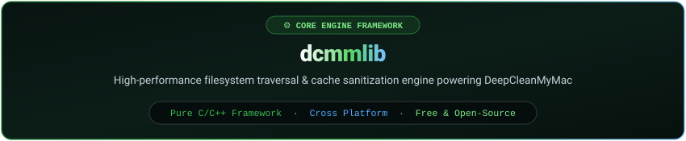

<!--
  ┌─────────────────────────────────────────────────────────────────┐
  │  DHANUSH H V                                                    │
  │  Full-Stack & Systems Craftsman · Bengaluru, India (IST)        │
  │                                                                 │
  │  "Ships UI that feels expensive,                                │
  │   and CLIs that feel instantaneous."                            │
  └─────────────────────────────────────────────────────────────────┘
-->

<div align="center">

<!-- Hero Terminal SVG Banner -->
<a href="https://dhanushhv.com">
  
</a>

<br/><br/>

<!-- Real-time Typing Subtitles -->
<a href="https://dhanushhv.com">
  
</a>

<br/>

<!-- Quick Social Badges -->
<p align="center">
  <a href="https://dhanushhv.com"></a>
  <a href="https://themux.dev"></a>
  <a href="https://www.linkedin.com/in/dhanush-h-v-1b85b41b2/"></a>
  <a href="https://twitter.com/dhanushh48"></a>
  <a href="https://github.com/DHANUSH-web"></a>
</p>

</div>

<p align="center">
  
</p>

### `❯` sysinfo --profile

```yaml
self:
  engineer: "Dhanush H V"
  focus: "Software Design & Development"
  work: "Software Developer - Remote, Ex-Amazon L4 Software Engineer", 4+ years of experience
  status: "🟢 Currently developing a cross-platform framework dcmmlib and a native macOS application DeepCleanMyMac"
```

<p align="center">
  
</p>

## 🚀 Flagship works

<!-- Detailed Flagship Breakdown -->
<table>
<tr>
<th width="50%" align="left"> macOS &amp; Systems Tooling</th>
<th width="50%" align="left">⚡ Developer Tooling &amp; Web Platforms</th>
</tr>
<tr>
<td valign="top">

### 1. **[DeepCleanMyMac](https://github.com/DHANUSH-web/DeepCleanMyMac)**
`macOS` · `Native Utility` · `Storage Optimization`  
> A Native macOS application to scan Mac HD and clean heavy unnecessary junk, developed with AppKit and Objective-C++ powered by dcmmlib, and entire application with <2MB of total bundle size

---

### 2. **[dcmmlib](https://github.com/DHANUSH-web/dcmmlib)**
`Systems Framework` · `High-Performance` · `DeepCleanMyMac Engine`  
> The high-performance core engine and disk traversal framework backing **DeepCleanMyMac**. Engineered for safe, high-speed filesystem scanning, permissions verification, and cross-platform funtionalities to build cross-platform native applications with C++.

---

### 3. **[c-logger](https://github.com/DHANUSH-web/c-logger)**
`C` · `Header-Only`
> A simple, tiny header library developed in pure C to provide easy accesss to logging utilities with built-in buffer manager to scaffold all logger instances at once

</td>
<td valign="top">

### 4. **[mux (Rust CLI)](https://github.com/DHANUSH-web/mux)** &amp; **[mux.dev](https://themux.dev)**
`Rust` · `CLI` · `Next.js` · [themux.dev](https://themux.dev)  
> **mux** is a Cargo-like CLI workflow tool for C/C++ development (scaffolding, building with Clang/GCC/MSVC, testing, and dependency management).  
> **[mux.dev](https://themux.dev)** is its dedicated product site built with Next.js, hosting dynamic documentation, and installation scripts.

---

### 5. **[Portfolio Website](https://dhanushhv.com)**
`Next.js` · `TypeScript` · `Tailwind CSS` · `DaisyUI` · `Firebase` · `Vercel`
> Personal engineering home & experiment canvas designed with fluid micro-interactions, dark aesthetic precision, and 60fps performance budgets.

---

### 6. **[cpp-logger](https://github.com/DHANUSH-web/cpp-logger)**
`C++17/20` · `Header-Only`  
> Type-safe modern C++ logging header library built with minimal compile overhead and zero runtime bottlenecks.

</td>
</tr>
</table>

<br/>

## Active Flagship Projects
<!-- 1. DeepCleanMyMac Spotlight Banner -->
<div align="center">

<a href="https://github.com/DHANUSH-web/DeepCleanMyMac">
  
</a>

<br/><br/>

[](https://github.com/DHANUSH-web/DeepCleanMyMac)
[](https://github.com/DHANUSH-web/DeepCleanMyMac)
[](https://github.com/DHANUSH-web/dcmmlib)

</div>

<br/>

<!-- 2. dcmmlib Spotlight Banner -->
<div align="center">

<a href="https://github.com/DHANUSH-web/dcmmlib">
  
</a>

<br/><br/>

[](https://github.com/DHANUSH-web/dcmmlib)
[](https://github.com/DHANUSH-web/dcmmlib)
[](https://github.com/DHANUSH-web/dcmmlib)

</div>

<br/>

<!-- 3. mux & mux.dev Spotlight Banner -->
<div align="center">

<a href="https://themux.dev">
  
</a>

<br/><br/>

[](https://themux.dev)
[](https://github.com/DHANUSH-web/mux)
[](https://github.com/DHANUSH-web/mux)

</div>

```bash
# ⚡ Install mux instantly on Unix / macOS (served via mux.dev):
curl -fsSL https://themux.dev/install.sh | sh

# 🪟 Install mux on Windows PowerShell (served via mux.dev):
irm https://themux.dev/install.ps1 | iex
```

<div align="center">

<a href="https://github.com/DHANUSH-web/mux">
  
</a>
<a href="https://github.com/DHANUSH-web/c-logger">
  
</a>
<a href="https://github.com/DHANUSH-web/cpp-logger">
  
</a>

</div>

<p align="center">
  
</p>

## 🌐 Web Products &amp; Experiments

<table>
<tr>
<td width="50%" valign="top">

- 🛰️ **[Orbital Radar](https://orbital-radar-beta.vercel.app)**  
  `Next.js` · `Three.js` · `WebSockets`  
  *Live interactive Low Earth Orbit (LEO) satellite radar and trajectory visualizer.*

- 📊 **[YouTube Explorer](https://yexplorer.vercel.app)**  
  `React` · `REST API` · `Analytics`  
  *High-throughput YouTube channel intelligence and video analytics dashboard.*

</td>
<td width="50%" valign="top">

- 🎨 **[pycol-python-qt](https://github.com/DHANUSH-web/pycol-python-qt)**  
  `Python` · `Qt` · `Desktop UI`  
  *Native cross-platform desktop UI color palette engine and harmony generator.*

- ⚡ **[API Parser](https://api-parser.vercel.app)**  
  `TypeScript` · `Next.js` · `DevTool`  
  *Interactive REST endpoint diagnostic and API payload tester.*

</td>
</tr>
</table>

<details>
<summary><strong>🔍 Expand for more experiments &amp; archives</strong></summary>
<br/>

- 💎 **[NFT Showcase](https://savagenft.vercel.app)** — Web3 digital collectible discovery platform on OpenSea API.
- 🎨 **[PyCOL Web](https://pycol.netlify.app)** — Web-based color exploration engine and palette builder.
- 🏛️ **[Archive Portfolio](https://dhv.vercel.app)** — Early frontend design experiment built with React & Chakra UI.

</details>

<p align="center">
  
</p>

## 💻 Tech Arsenal

<div align="center">

| Domain | Technologies &amp; Tooling |
| :--- | :--- |
| **Systems &amp; Core** | `Rust` `C` `C++` `Python` `TypeScript` `JavaScript` `Java` `Bash` |
| **Frontend &amp; UX** | `Next.js 14` `React` `Tailwind CSS` `HTML5 / CSS3` `Chakra UI` |
| **Backend &amp; Cloud** | `Node.js` `Express` `MongoDB` `PostgreSQL` `Firebase` `Vercel` |
| **Workflow &amp; DevOps** | `Git` `GitHub Actions` `Docker` `Linux / Darwin` `Neovim` `CMake` |

<br/>

<!-- Interactive Skill Icons Grid -->
<a href="https://skillicons.dev">
  
</a>

</div>

<p align="center">
  
</p>

## 📊 Live Telemetry &amp; GitHub Analytics

<div align="center">

<p align="center">
  <a href="https://github.com/search?q=author%3ADHANUSH-web+is%3Apr&type=pullrequests">
    
  </a>
  <a href="https://github.com/DHANUSH-web?tab=overview">
    
  </a>
</p>

<!-- Stats Grid -->
<table border="0">
  <tr>
    <td align="center" valign="middle">
      
    </td>
    <td align="center" valign="middle">
      
    </td>
  </tr>
  <tr>
    <td colspan="2" align="center" valign="middle">
      
    </td>
  </tr>
</table>

<br/>

<!-- Productive Hours & Summary Cards -->


<br/><br/>

<!-- Dynamic Contribution Snake -->
<picture>
  <source media="(prefers-color-scheme: dark)" srcset="https://raw.githubusercontent.com/DHANUSH-web/DHANUSH-web/output/github-contribution-grid-snake-dark.svg" />
  <source media="(prefers-color-scheme: light)" srcset="https://raw.githubusercontent.com/DHANUSH-web/DHANUSH-web/output/github-contribution-grid-snake.svg" />
  
</picture>

</div>

<p align="center">
  
</p>

<!-- Footer Terminal & Socials -->
<div align="center">

```
dhanush@bengaluru:~$ mux ping --dest network
pong ── 200 OK ── ready for collaboration, open-source & product builds
```

<p align="center">
  <a href="https://dhanushhv.com/contact"></a>
  &nbsp;
  <a href="https://www.linkedin.com/in/dhanush-h-v-1b85b41b2/"></a>
  &nbsp;
  <a href="https://twitter.com/dhanushh48"></a>
  &nbsp;
  <a href="https://instagram.com/dhanushh48"></a>
</p>

<sub>Crafted with obsessive attention to detail. Built for speed.</sub>

</div>
